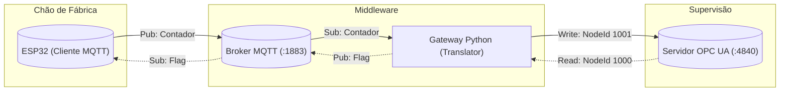

# 🏭 Miniprojeto IIoT: Gateway ESP32 MQTT ↔ OPC UA

[cite_start]Este repositório contém a implementação de um sistema de interoperabilidade para Indústria 4.0, conectando um dispositivo de borda (**ESP32**) a um nível de supervisão (**OPC UA**) através de um Gateway proprietário desenvolvido em Python[cite: 1, 17].

[cite_start]Desenvolvido como requisito da disciplina **Sistemas Inteligentes e Conectados** do **PPGEEL (Programa de Pós-graduação em Engenharia Elétrica)** da UEA - Turma 2025[cite: 3, 7].

---

## 👥 Autores
* **Warley Nogueira**
* **João Neves**

---

## 🎯 Objetivo e Funcionalidades

[cite_start]O sistema integra o chão de fábrica (Field Level) com o supervisório (Control Level)[cite: 38].

### Lógica de Controle
1.  **Monitoramento (Uplink):** O ESP32 publica um contador inteiro (`Int16`) via MQTT. [cite_start]O Gateway traduz e escreve este valor em um nó do Servidor OPC UA[cite: 14, 31].
2.  **Controle (Downlink):** O Servidor OPC UA possui uma `Flag` (Booleana). [cite_start]O Gateway monitora esta flag e envia comandos para o ESP32[cite: 13, 30].
    * [cite_start]✅ **Flag = True:** O contador oscila em onda triangular: **0 → 9 → 0**[cite: 15].
    * [cite_start]⏸️ **Flag = False:** O contador pausa no valor atual[cite: 16].

### Tecnologias Utilizadas
* [cite_start]**Firmware:** C++ (Arduino Core / PlatformIO) com lógica não-bloqueante (`millis`)[cite: 67].
* [cite_start]**Gateway:** Python com bibliotecas `paho-mqtt` e `opcua`[cite: 107, 109].
* **Infraestrutura:** Broker MQTT (Mosquitto) e Servidor OPC UA (FreeOpcUa).

---

## 🏗️ Arquitetura do Sistema

---

⚙️ Pré-requisitos e Instalação
1. Hardware Necessário
Placa de desenvolvimento ESP32.

Cabo USB de dados.

PC com Python 3 instalado.

2. Software Necessário
VS Code com extensão PlatformIO (recomendado) ou Arduino IDE.

Broker MQTT (Ex: Mosquitto).

3. Instalação das Dependências Python
No terminal, execute:

Bash

pip install opcua paho-mqtt
🚀 Como Executar (Passo a Passo)
Para garantir o funcionamento, siga estritamente esta ordem de execução:

Passo 1: Configurar IPs
Verifique o IP da sua máquina (ex: ipconfig no Windows).

Atualize o arquivo gateway.py com o IP do seu Broker MQTT.

Atualize o arquivo src/main.cpp (no firmware) com o IP do Broker e suas credenciais Wi-Fi.

Passo 2: Iniciar a Infraestrutura
Abra dois terminais na pasta raiz do projeto:

Terminal 1 (Servidor OPC UA):

Bash

python server_opcua.py

Saída esperada: Servidor OPC UA iniciado em opc.tcp://0.0.0.0:4840.

Terminal 2 (Gateway):

Bash

python gateway.py
Saída esperada: [MQTT] Conectado e [OPC-UA] Conectado.

Passo 3: Rodar o Firmware
Conecte o ESP32 via USB.

Faça o upload do código usando o PlatformIO (Seta → na barra inferior).

Abra o monitor serial (Serial Monitor) para acompanhar os logs.

✅ Validação e Testes
Cenário 1: Oscilação (Flag = True)
Por padrão, a Flag inicia como False.

Utilize um cliente OPC UA (como o UaExpert) para conectar em opc.tcp://localhost:4840.

Altere o valor do nó Flag (ns=1;i=1000) para True.

Resultado: O ESP32 começará a enviar contagens: 0, 1, 2... 8, 9, 8, 7....

Cenário 2: Pausa (Flag = False)
Altere o valor do nó Flag para False.

Resultado: O ESP32 deve parar de enviar mensagens e manter o último valor no display/log.

Cenário 3: Reconexão
Desligue o servidor OPC UA (Ctrl+C no Terminal 1).

O Gateway deve entrar em modo de reconexão.

Reinicie o servidor. O sistema deve se recuperar automaticamente.

📝 Licença
Este projeto é de uso acadêmico para fins de avaliação na disciplina de Sistemas Inteligentes e Conectados - UEA.
