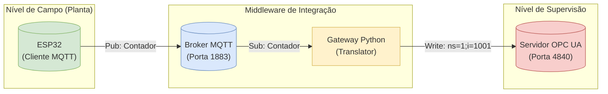

# 🏭 Miniprojeto IIoT: Gateway ESP32 MQTT ↔ OPC UA

Este repositório contém a implementação de um sistema de interoperabilidade para Indústria 4.0, conectando um dispositivo de borda (**ESP32**) a um nível de supervisão (**OPC UA**) através de um Gateway proprietário desenvolvido em Python.

Desenvolvido como requisito da disciplina **Sistemas Inteligentes e Conectados** do **PPGEEL (Programa de Pós-graduação em Engenharia Elétrica)** da UEA - Turma 2025.

---

## 👥 Autores
* **Warley Nogueira**
* **João Neves**

---

## 🎯 Objetivo e Funcionalidades

O projeto resolve o problema de comunicação entre protocolos distintos (OT/IT), atuando como uma ponte bidirecional:

### 1. Monitoramento (Sentido Ascendente)
* **Origem:** O ESP32 gera um contador numérico (`Int16`).
* **Transporte:** Publica via MQTT no tópico `UEA/MPEE/sic/Contador`.
* **Destino:** O Gateway recebe e escreve no Servidor OPC UA (Nó `ns=1;i=1001`).

### 2. Controle (Sentido Descendente)
* **Origem:** O Servidor OPC UA possui uma `Flag` de controle (Booleana) no nó `ns=1;i=1000`.
* **Transporte:** O Gateway monitora este nó e, ao detectar mudança, publica no MQTT (`UEA/MPEE/sic/Flag`).
* **Ação:** O ESP32 reage ao comando:
    * ✅ **Flag = True:** O contador oscila em onda triangular (**0 → 9 → 0**).
    * ⏸️ **Flag = False:** O contador pausa no valor atual.

---

## 🏗️ Arquitetura do Sistema

O sistema é organizado em camadas de rede, mensageria e aplicação:

